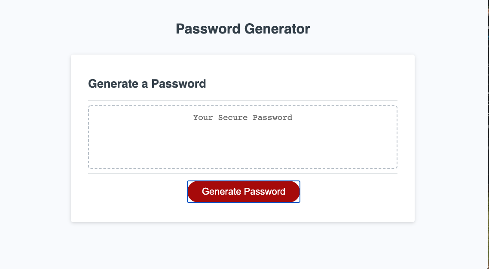

# Homework Assignment 3: Random Password Generator
---

## Getting Started
---
These instructions will get you a copy of the project up and running on your local machine for development and testing purposes. See deployment for notes on how to deploy the project on a live system.

## Prerequisites
---
Windows or Mac file expolorer
Working web browers (ie Chrome browser, Mozilla Firefoxi)
Code editing software (ie Sublime text, Visual Studio Code)
Terminal window

## Installation
---
Using your filesystem explorer locate the html and css files
Then either open the html files in browser for inspection, or using your choice of code editor to edit.

## Built With
---
- Visual Studio Code
- Chrome Browser

## Authors
---
- Dale Foskey  dalefoskey@icloud.com
